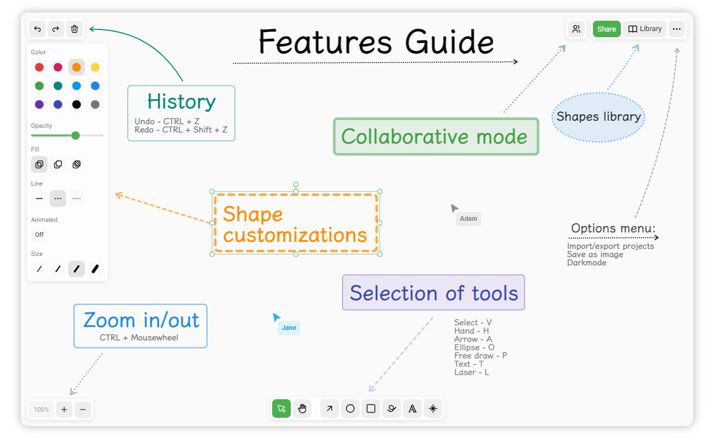

# drawflux

**A collaborative virtual whiteboard tool for sketching diagrams.**

<picture>
    <source media="(prefers-color-scheme: dark)" srcset="./assets/screenshot-dark.png">
    
</picture>

# Features

- Selection of tools - rectangle, ellipse, arrow, free-draw, text.
- Customizable shape style - color, size, fill, opacity, line style, animation.
- Shapes library.
- Live collaboration.
- Zoom and panning.
- History undo / redo.
- Export to PNG / JSON.
- Offline support.
- Dark Mode.

# Local development

### Pre-requisites

- _Node.js:_ `>=18.17.0`
- _pnpm:_ `>=8.6.12`

### Install

Clone the repository to your local machine.

Install dependencies:

```bash
pnpm install
```

### Docker

The docker-compose file sets up a posgresql database and the backend for you.\
Alternatively you can also set up your own postgresql database, you will need to set
[environment variables](https://node-postgres.com/features/connecting#environment-variables) for it to work.

#### Requirements:

- [x] [docker-engine](https://docs.docker.com/get-docker) `>=24` and [buildkit](https://docs.docker.com/build/buildkit/).
- [x] [docker-compose v2](https://docs.docker.com/compose).

#### Usage:

```sh
docker compose build
docker compose up
docker compose down
```

### Development Mode

Make sure to build packages before starting the development mode:

```bash
pnpm packages:build
```

Run client in development mode:

```bash
pnpm dev:client
```

Run server in development mode (if you don't use docker-compose):

```bash
pnpm dev:server
```

# Monorepo Essentials

## Structure

```
├── apps
│   ├── client (react codebase)
│   └── server (express api)
└── packages
    ├── eslint-config-bases (eslint configs)
    └── shared              (utils, types, schemas, themes)
```

## Scripts

Some handy scripts that can be run from any directory.

| Name                      | Description                                          |
| ------------------------- | ---------------------------------------------------- |
| `pnpm dev:app`            | Run server and client in dev mode with --stream flag |
| `pnpm dev:client`         | Run react client in dev mode                         |
| `pnpm dev:server`         | Run express server in dev mode                       |
| `pnpm g:build`            | Run build in all workspaces                          |
| `pnpm g:typecheck`        | Run typechecks in all workspaces                     |
| `pnpm g:lint`             | Display linter issues in all workspaces              |
| `pnpm g:fix-all-files`    | Attempt to run linter auto-fix in all workspaces     |
| `pnpm packages:build`     | Build all packages workspaces                        |
| `pnpm packages:lint`      | Display packages linter issues                       |
| `pnpm packages:typecheck` | Run packages typechecks                              |

# Acknowledgments

Awesome open-source packages used in this project:

- [React Konva](https://konvajs.org/docs/react/Intro.html)
- [Radix UI](https://www.radix-ui.com)
- [Stitches](https://stitches.dev)
- [zod](https://zod.dev)
- [node-postgres](https://node-postgres.com)
- [qr-code](https://github.com/soldair/node-qrcode)
